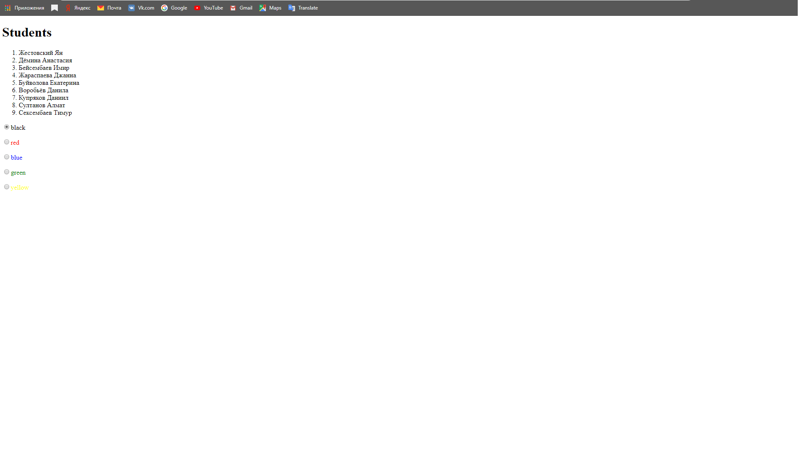
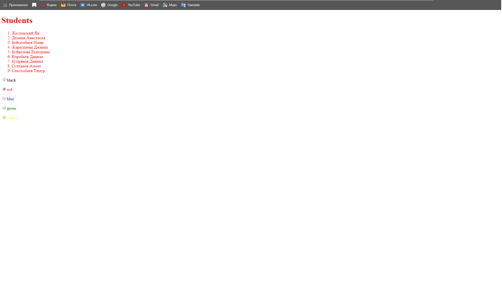
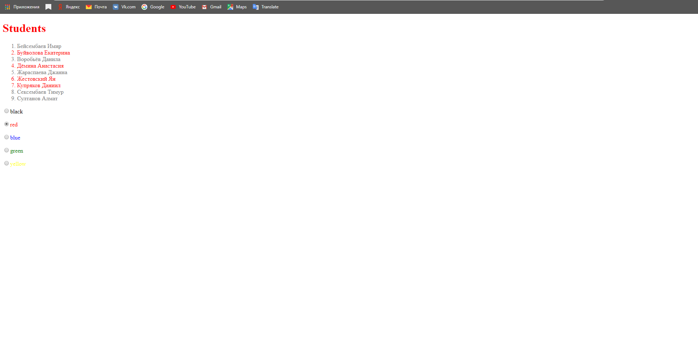
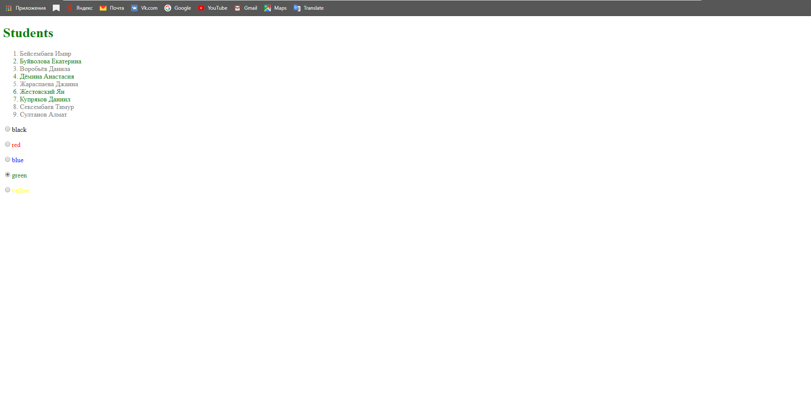

# KotlinJS 1.4
---
HTML DSL
-----------------------------------

### 1. Программа при первом запуске

### 2. Программа при нажатии на радиокнопку "red'

### 3. Программа при нажатии на студентов из списка

### 4. Программа при нажатии на заголовок "Students"

### 5. Программа при нажатии на радиокнопку "green'

